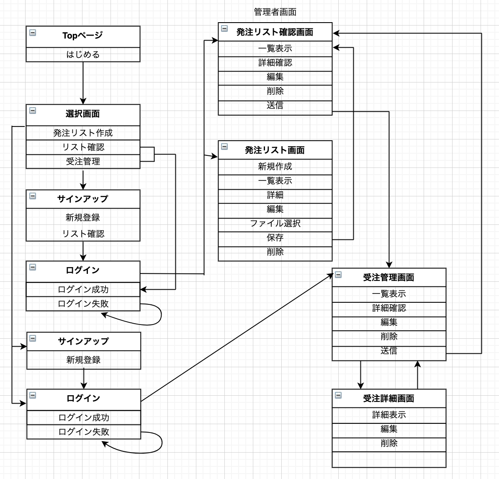

# README
___
## 開発言語
- Ruby2.6.5
- Rails5.2.5
___
## 就業Termの技術
- devise
- AWS
___
## カリキュラム外の技術
- ransack
___
## 実行手順
% git clone git@github.com:Hiryo/prototype_app.git  
% cd prototype_app  
% bundle install  
% rails db:create db:migrate  
% rails s  
___
## カタログ設計
https://docs.google.com/spreadsheets/d/14-ToORPjrmmufEX8T0N3YN_f1eJ7N3q8vw577GKgYSc/edit?usp=sharing
___
## テーブル定義書
https://docs.google.com/spreadsheets/d/13RQXnzHiPdJmBedsiUPnru5xWqEi1GVO_ywaCzbMcj4/edit?usp=sharing
___
## ワイヤーフレーム
https://cacoo.com/diagrams/xOYvHGnv9pVF8C4L/5F823
___
## 画面遷移図
