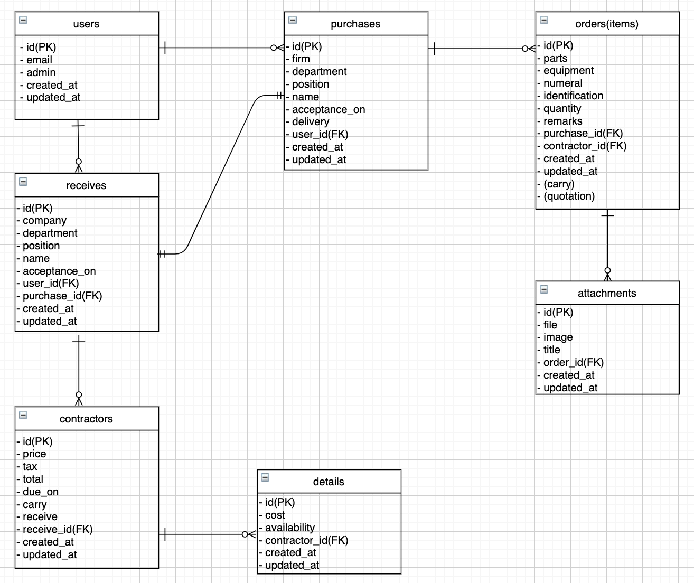
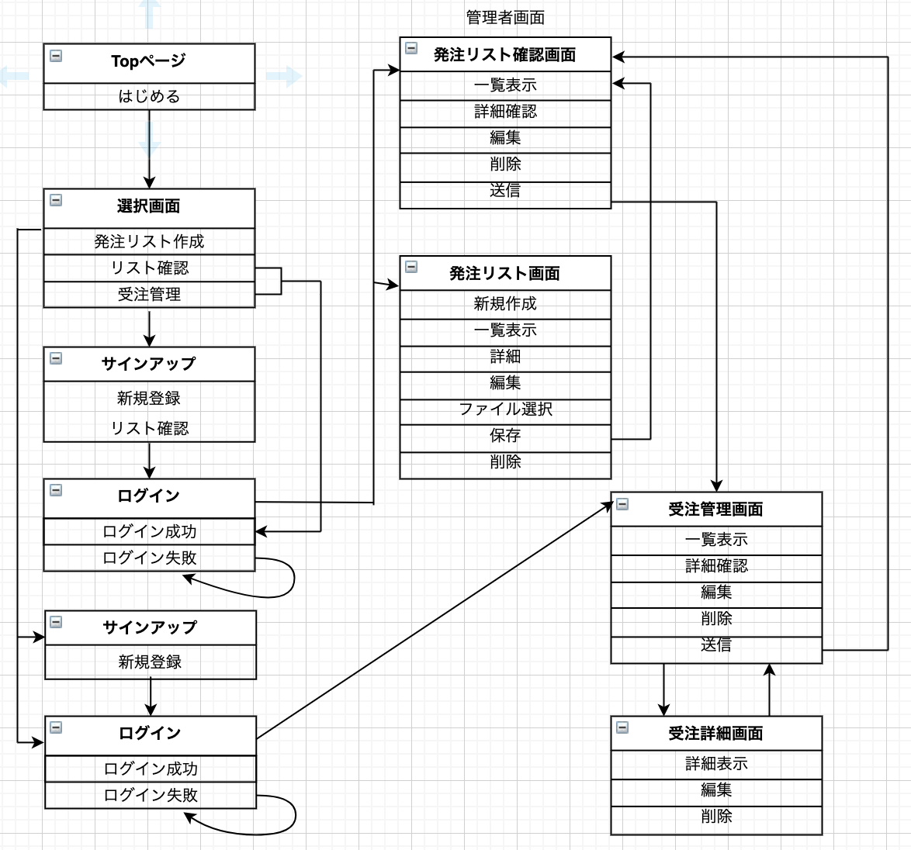

# README
___
## 概要
現場からの備品発注時における、発注リスト作成、備品管理がこのアプリケーションででき、  
受注側で簡単かつ素早く見積り作成が可能。  
さらに発注会社側で、現場から提出された発注内容の編集及び承認、削除等ができ業務を効率化する。
___
## 開発背景
以前、発注業務を担当した際に、現場が作成したExcelを提出してもらい、そこから見積りを取り、  
発注するといった流れであった。  
受注する側と発注する側でのメールのやり取りが何度もある事で、時間のロス及びメールの見落としにも  
繋がりかねないと考えていた。  
また、相見積りを取った際には提示された見積り内容を印刷し見比べ、手書きで修正していた為、  
この一連のやりとりには、効率性がなく、発注側の労力もさる事ながら時代に逆行していると思えた。
___
## 開発言語
- Ruby2.6.5
- Rails5.2.5
___
## 就業Termの技術
- devise
- Ajax
___
## カリキュラム外の技術
- ransack
___
## 実行手順
```
% git clone git@github.com:Hiryo/prototype_app.git  
% cd prototype_app  
% bundle install  
% rails db:create db:migrate  
% rails s  
```
___
## カタログ設計
https://docs.google.com/spreadsheets/d/14-ToORPjrmmufEX8T0N3YN_f1eJ7N3q8vw577GKgYSc/edit?usp=sharing
___
## テーブル定義書
https://docs.google.com/spreadsheets/d/13RQXnzHiPdJmBedsiUPnru5xWqEi1GVO_ywaCzbMcj4/edit?usp=sharing
___
## ワイヤーフレーム
https://cacoo.com/diagrams/xOYvHGnv9pVF8C4L/5F823
___
## ER図


## 画面遷移図
